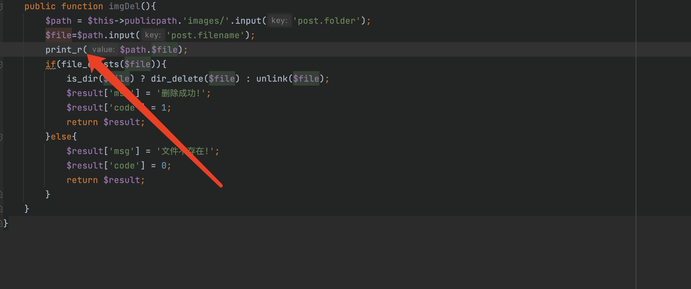
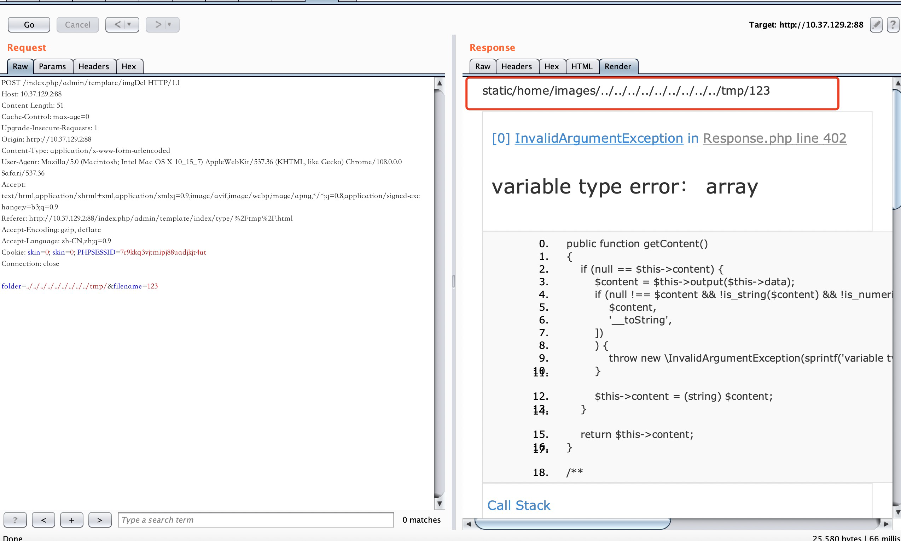

# CLTPHP <= 6.0 Improper Input Validation 1
## Description
    The system client did not handle the parameters correctly, resulting in arbitrary file deletion.
## Vendor Homepage
    https://gitee.com/chichu/cltopen/
    https://www.cltphp.com/

## Author
    HuBen-Lab
## Proof of Concept
File:`application/admin/controller/Template.php `

Exploiting this vulnerability requires logging into the system.

payload:

```
admin/template/imgDel 

post：folder=../../../../../../../../../&filename=tmp/123
```

The method of writing output has been executed, but because the images directory does not exist by default, the exploit will fail. If the images directory exists, it can be exploited normally (linux platform).
If it is in windows is not affected by the images directory, you can use the vulnerability normally



