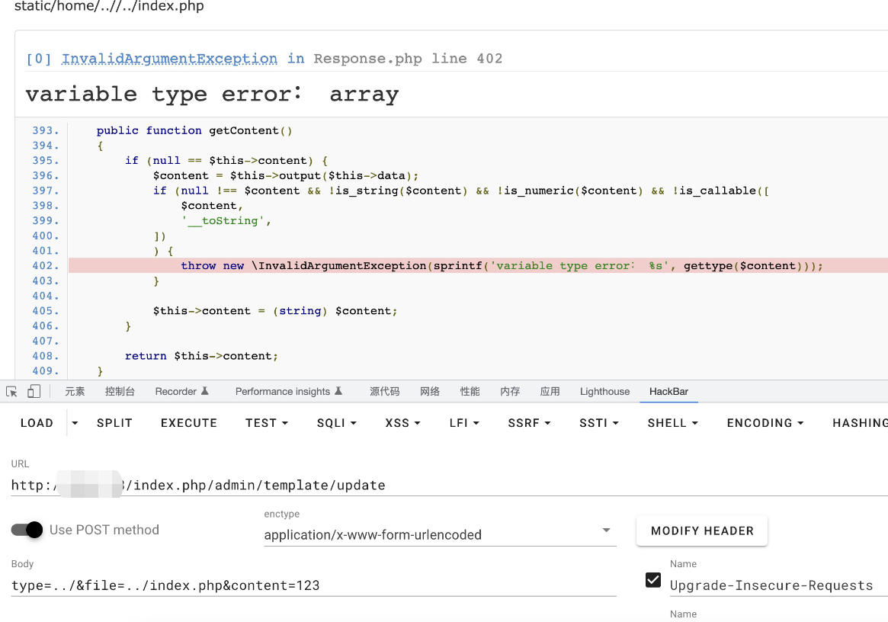
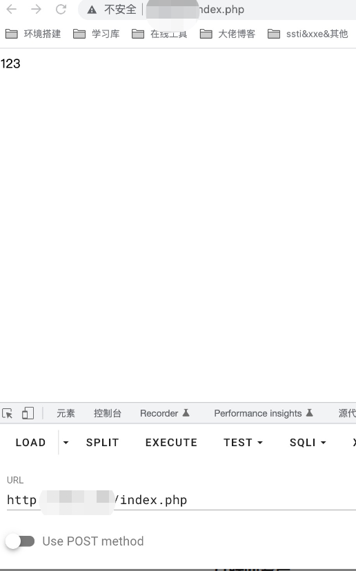

# CLTPHP <= 6.0 Unrestricted Upload of File with Dangerous Type 2
## Description
    The system client does not handle these parameters correctly, resulting in an Unrestricted Upload of File with Dangerous Type.
## Vendor Homepage
    https://gitee.com/chichu/cltopen/
    https://www.cltphp.com/

## Author
    HuBen-Lab
## Proof of Concept
File:`application/admin/controller/Template.php `

Exploiting this vulnerability requires logging into the system.

This vulnerability can only modify files that exist on the system.

Change index.php to 123

