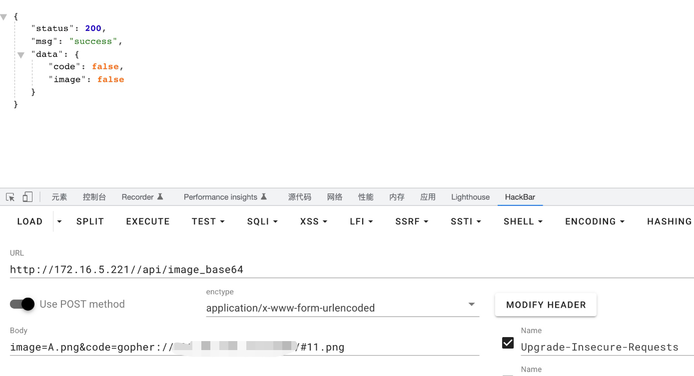
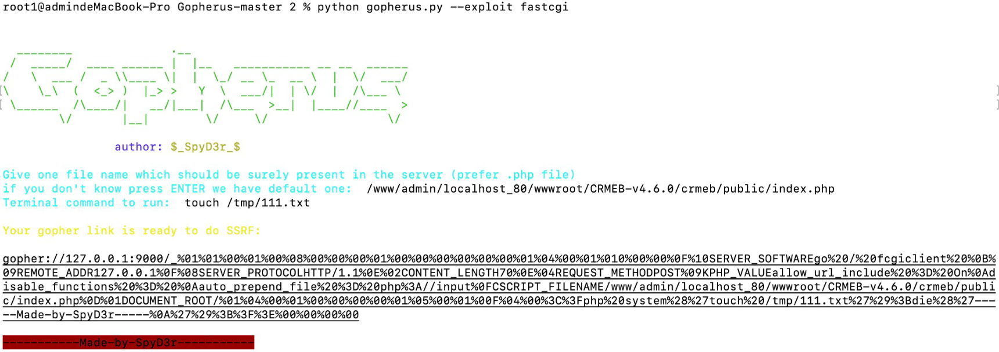
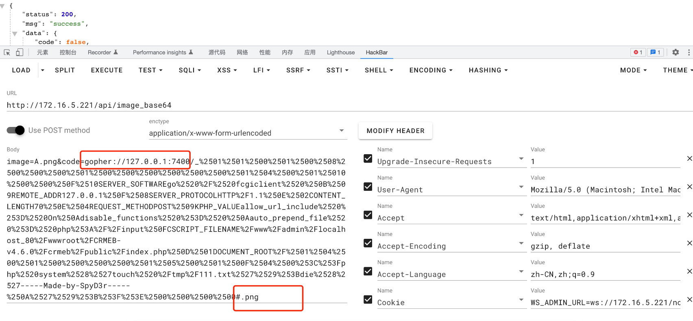
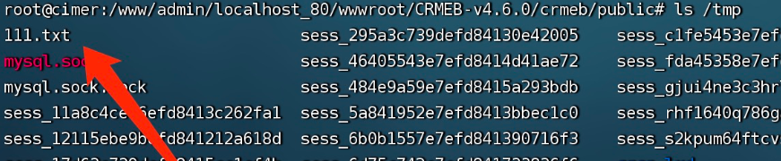

# CRMEB is vulnerable to Server-side request forgery (SSRF)

## Description
    CRMEB <= 4.6.0 is vulnerable to Server-side request forgery (SSRF)
## Vendor Homepage
    https://gitee.com/ZhongBangKeJi/CRMEB,https://www.crmeb.com/

## Author
    HuBenLab
## Proof of Concept
The problem is in the `/api/image_base64` route, the corresponding function is get_image_base64 in `api/controller/v1/PublicController.php`.

```php
    public function get_image_base64(Request $request)
    {
        [$imageUrl, $codeUrl] = $request->postMore([
            ['image', ''],
            ['code', ''],
        ], true);//接收post传参
        if ($imageUrl !== '' && !preg_match('/.*(\.png|\.jpg|\.jpeg|\.gif)$/', $imageUrl)) {
            return app('json')->success(['code' => false, 'image' => false]);
        }//判断后缀名
        if ($codeUrl !== '' && !preg_match('/.*(\.png|\.jpg|\.jpeg|\.gif)$/', $codeUrl)) {
            return app('json')->success(['code' => false, 'image' => false]);
        }
        try {
            $code = CacheService::get($codeUrl, function () use ($codeUrl) {
                $codeTmp = $code = $codeUrl ? image_to_base64($codeUrl) : false;
                if (!$codeTmp) {
                    $putCodeUrl = put_image($codeUrl);
                    $code = $putCodeUrl ? image_to_base64(app()->request->domain(true) . '/' . $putCodeUrl) : false;
                    $code ?? unlink($_SERVER["DOCUMENT_ROOT"] . '/' . $putCodeUrl);
                }
                return $code;
            });
            $image = CacheService::get($imageUrl, function () use ($imageUrl) {//生成缓存
                $imageTmp = $image = $imageUrl ? image_to_base64($imageUrl) : false;//进入image_tobase64函数
                if (!$imageTmp) {
                    $putImageUrl = put_image($imageUrl);
                    $image = $putImageUrl ? image_to_base64(app()->request->domain(true) . '/' . $putImageUrl) : false;
                    $image ?? unlink($_SERVER["DOCUMENT_ROOT"] . '/' . $putImageUrl);
                }
                return $image;
            });
            return app('json')->success(compact('code', 'image'));
        } catch (\Exception $e) {
            return app('json')->fail(100005);
        }
    }
```

Following up on the image_to_base64 function, it is clear that there is ssrf, where $avatar is under our control, $imageUrl or $codeUrl.

```php
    function image_to_base64($avatar = '', $timeout = 9)
    {
        $avatar = str_replace('https', 'http', $avatar);//把https替换成http
        try {
            $url = parse_url($avatar);
            $url = $url['host'];
            $header = [
                'User-Agent: Mozilla/5.0 (Windows NT 6.1; Win64; x64; rv:45.0) Gecko/20100101 Firefox/45.0',
                'Accept-Language: zh-CN,zh;q=0.8,en-US;q=0.5,en;q=0.3',
                'Accept-Encoding: gzip, deflate, br',
                'accept: text/html,application/xhtml+xml,application/xml;q=0.9,image/webp,image/apng,*/*;q=0.8,application/signed-exchange;v=b3;q=0.9',
                'Host:' . $url
            ];
            $dir = pathinfo($url);
            $host = $dir['dirname'];
            $refer = $host . '/';
            $curl = curl_init();
            curl_setopt($curl, CURLOPT_REFERER, $refer);
            curl_setopt($curl, CURLOPT_URL, $avatar);
            curl_setopt($curl, CURLOPT_RETURNTRANSFER, true);
            curl_setopt($curl, CURLOPT_FOLLOWLOCATION, true);
            curl_setopt($curl, CURLOPT_ENCODING, 'gzip');
            curl_setopt($curl, CURLOPT_CONNECTTIMEOUT, $timeout);
            curl_setopt($curl, CURLOPT_HTTPHEADER, $header);
            curl_setopt($curl, CURLOPT_SSL_VERIFYPEER, FALSE);
            $data = curl_exec($curl);//发起请求
            $code = curl_getinfo($curl, CURLINFO_HTTP_CODE);
            curl_close($curl);

            if ($code == 200) {
                return "data:image/jpeg;base64," . base64_encode($data);//把获取的图片base64编码
            } else {
                return false;
            }
        } catch (\Exception $e) {
            return false;
        }
    }
}
```

Try it with gopher.



Using gopher to attack fpm

Utilization conditions:
1. know fpm port 
2. apache or nginx must use fpm 
3. know the absolute path of a php file

First use the popherus tool to successfully payload



Directly start the attack, the local fpm port is 7400, the last .png is to bypass the first if, and then it's don't forget to url code the _ after the payload once again.



Check out the results

