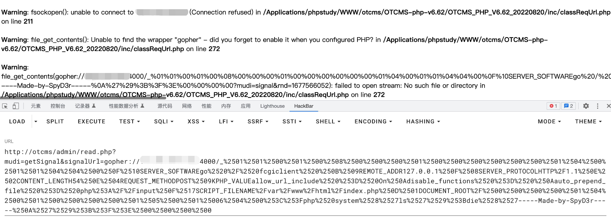
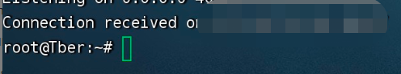

# OTCMS MCCMS is vulnerable to Server-side request forgery (SSRF)
## Description
    OTCMS MCCMS is vulnerable to Server-side request forgery (SSRF)
## Vendor Homepage
    http://otcms.com/

## Author
    HuBenLab
## Proof of Concept
payload:

```
http://otcms/admin/read.php?mudi=getSignal&signalUrl=
```

Using gopher protocol to attack intranet fpm



