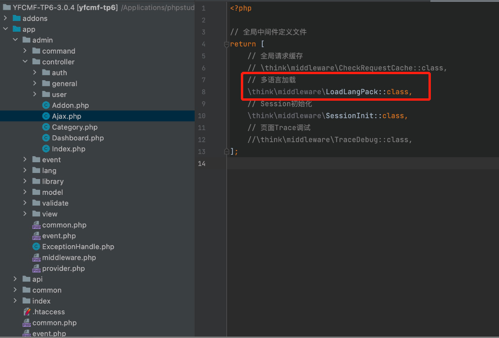

# YFCMF-TP6-3.0.4 has a Remote Command Execution (RCE) vulnerability
## Description
    YFCMF-TP6-3.0.4 has a Remote Command Execution (RCE) vulnerability
## Vendor Homepage
    https://github.com/0377/yfcmf-tp6,https://www.iuok.cn/

## Author
    HuBenLab
## Proof of Concept
This vulnerability is entirely caused by thinkphp framework, in yfcmf by default open multi-language, the attacker can use pearcmd file contains to achieve rce.

The path to the pearcmd file should be noted here

