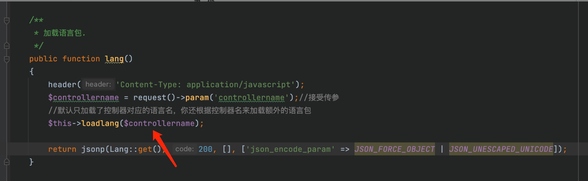
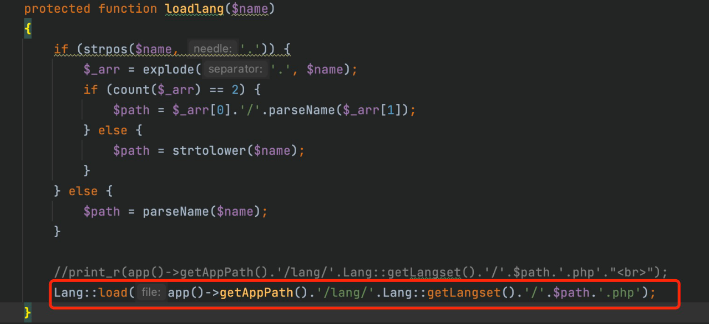
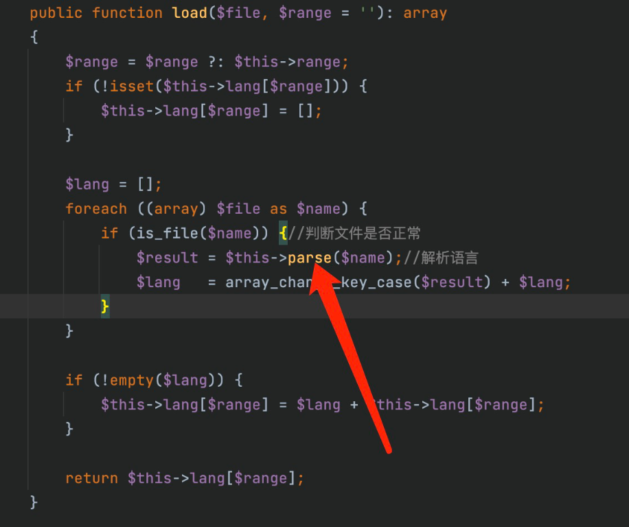
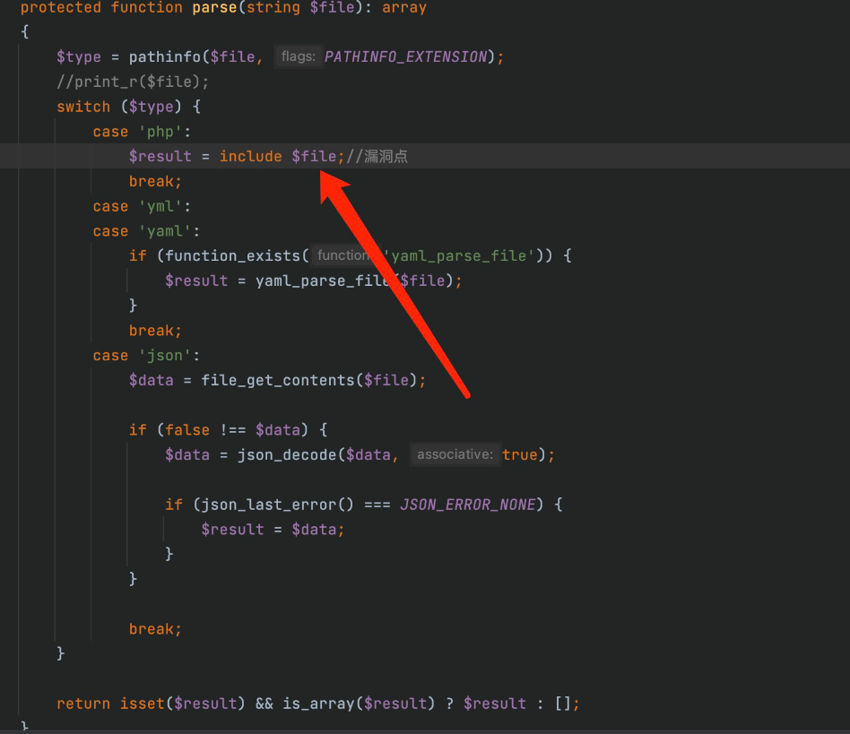
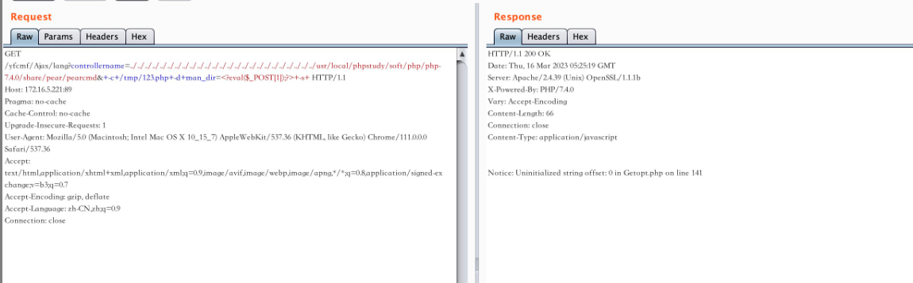
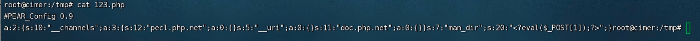

# YFCMF-TP6-3.0.4 has a Remote Command Execution (RCE) vulnerability
## Description
    YFCMF-TP6-3.0.4 has a Remote Command Execution (RCE) vulnerability
## Vendor Homepage
    https://github.com/0377/yfcmf-tp6,https://www.iuok.cn/

## Author
    HuBenLab
## Proof of Concept
The problem is in `app/admin/controller/Ajax.php` in the lang function, the vulnerability can be in the framework does not open the multilingual when the inclusion of php files to achieve the effect of rce.

Start analyzing the code, first controllerername controllable, follow up loadlang function

The code above if is used to handle the path, the main code is in the lang::land function below.

Keeping following up, the load function will take the arguments we pass into the parse function for parsing.

The next step is to include the php file we control

